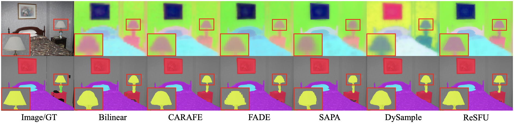

# ReSFU

Codes for our paper "A Refreshed Similarity-based Upsampler for Direct High-Ratio Feature Upsampling".


<div align="center">
  
</div><br/>

<div align="center">
  
</div><br/>

## Installation
First, install the 'FNS_Attn' module which requires CUDA compilation:
```shell
cd FNS_Attn/
python setup.py develop
```
(Optional) If you wish to use the mmsegmentation benchmark, install it by:
```shell
cd mmsegmentation/
pip install -e .
```
If you wish to use ReSFU in your own codes, you can check our main implementation [resfu.py](mmsegmentation/mmseg/models/upsamplers/resfu.py).

## Usage
To train the Segmenter-S model with ReSFU, run:
```shell
cd mmsegmentation/
sh tools/dist_train.sh configs/segmenter/segmenter_vit-s_fcn_8xb1-160k_ade20k-512x512_resfu.py 8 \
 --work-dir=work_dirs/segmenter_vit-s_fcn_8xb1-160k_ade20k-512x512_resfu
```
To train the SegFormer-B1 model with ReSFU, run:
```shell
cd mmsegmentation/
sh tools/dist_train.sh configs/segformer/segformer_mit-b1_8xb2-160k_ade20k-512x512_resfu.py 8 \
 --work-dir=work_dirs/segformer_mit-b1_8xb2-160k_ade20k-512x512_resfu
```
